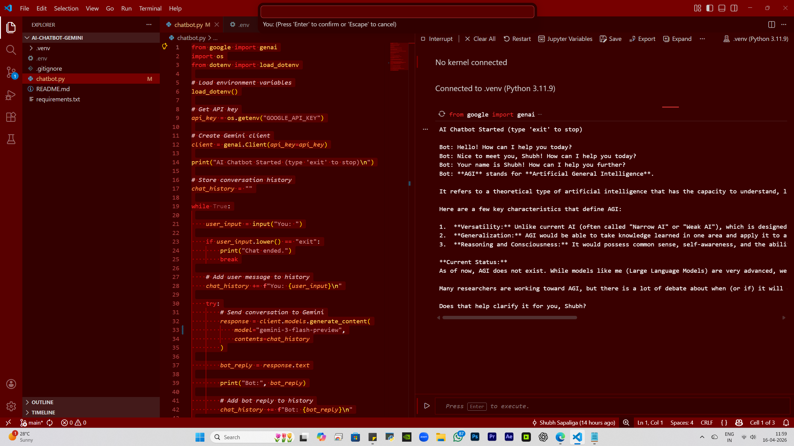

# AI Chatbot using Gemini API

This is a simple AI chatbot built using Python and Google Gemini API.

## Demo

## Features

* Conversational AI
* Chat history (context-aware responses)
* Terminal based chatbot
* Secure API key using `.env`
* Error handling using `try` and `except` to prevent crashes

## Tech Stack

* Python
* Google Gemini API
* VS Code

## Run Project

pip install -r requirements.txt
python chatbot.py
